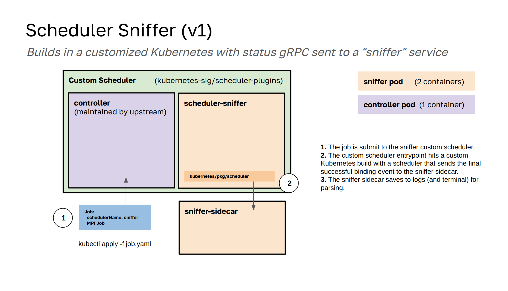

# Scheduler Sniffer

> Smells like HPC!👃️

The scheduler-sniffer is an attempt to build a custom-scheduler plugin that mimics using the default scheduler, but adds in the ability
to see what is going on. This is a work in progress and I've already changed the design several times - expect that to happen again! Currently I'm taking an approach of creating a custom scheduler plugin, but largely making it empty. It only serves as a means to provide a custom entrypoint to the main scheduler code, and I'll customize this to add pings to a gRPC service that can record decisions at each step.



🚧️ Under Development 🚧️

## Development

Try making a kind cluster first.

```bash
kind create cluster
```

Courtesy scripts are provided to build the sniffer and load into your local kind cluster.

```bash
./hack/kind-build.sh
```

Try submitting a job.

```bash
kubectl apply -f example/job.yaml
```

You can see from events that it was scheduled to the sniffer:

```bash
kubectl get events -o wide |  awk {'print $4" " $5" " $6'} | column -t | grep sniffer
```

You can also look at the sniffer logs to see the binding events printed:

```bash
$ kubectl exec -it sniffer-74c76ff4f8-hrqdn -c watcher -- cat /tmp/logs/sniffer.log
```
```console
{"object":"Pod","name":"local-path-provisioner-7577fdbbfb-w84m2","endpoint":"podUpdate","event":"ContainersReady","timestamp":"2024-04-20 18:22:03 +0000 UTC"}
{"object":"Pod","name":"local-path-provisioner-7577fdbbfb-w84m2","endpoint":"podUpdate","event":"PodScheduled","timestamp":"2024-04-20 18:22:00 +0000 UTC"}
```

You can grep for "Node" or "Pod" to filter events:

```bash
$ kubectl exec -it sniffer-74c76ff4f8-hrqdn -c watcher -- cat /tmp/logs/sniffer.log | grep Node
```
```console
{"object":"Node","name":"kind-control-plane","endpoint":"nodeUpdate","reason":"KubeletReady","message":"kubelet is posting ready status","event":"Ready","timestamp":"2024-04-22 01:08:24 +0000 UTC"}
{"object":"Node","name":"kind-control-plane","endpoint":"nodeUpdate","extra":{"capacity-cpu":"12","capacity-ephemeral-storage":"1921208544Ki","capacity-hugepages-1Gi":"0","capacity-hugepages-2Mi":"0","capacity-memory":"32512128Ki","capacity-pods":"110","allocatable-hugepages-2Mi":"0","allocatable-memory":"32512128Ki","allocatable-pods":"110","allocatable-cpu":"12","allocatable-ephemeral-storage":"1921208544Ki","allocatable-hugepages-1Gi":"0"}}
```

This is still early in development, more soon. I think likely we will need to update the output file to an actual database.

### Build Logic

The main scheduler container for the "sniffer" is built from the [Dockerfile](Dockerfile) here.
This logic used to be under the sig-scheduler-plugins repository with a `hack/build-images.sh`
script, but I found this logic complex, and there was no easy way to avoid building the controller
(which takes extra time). To speed things up, make the build more transparent, and allow
building a custom kube-scheduler command, I moved this up to the root. You can see the build logic in
the [Dockerfile](Dockerfile). When you run `make` to do the build, or use one of the [hack](hack)
scripts for a full build->deploy, the following will happen:

 - An upstreams directory with kubernetes and sig-scheduler-plugins is prepared
 - Changed files are copied into it
 - The sidecar [sniffer](sniffer) and scheduler image are built

My hope is that this scheduler will be able to support pointing to other plugin extensions to use.
What isn't clear to me is/will be the best way to combine them. 

### Organization

- [src](src) has code intending to be moved into the sig-scheduler-plugins repository
- [scheduler](scheduler) is slightly tweaked Kubernetes code with added gRPC for the sniffer
- [sniffer](sniffer) is the sniffer service (sidecar) to the scheduler

It would be cool to do this with eBPF, but I haven't found a good, working container base yet.

## Notes

Things to track for the simulator:
- keep track of pod to node mappings (this is the basic unit of what we need)
- node occupancy and time (which nodes contain which pods at what point)
 - TODO we likely want to use a database proper instead of a log file for larger runs

This will be a replacement for the in-tree Kubernetes scheduler, with the intention of adding a small service to ping and communicate
scheduling decisions. This is not meant for production use cases, but rather understanding what is happening in the scheduler. It 
will also serve as a prototype for me to understand developing an in-tree scheduler so we can eventually do one, for realsies.

## License

HPCIC DevTools is distributed under the terms of the MIT license.
All new contributions must be made under this license.

See [LICENSE](https://github.com/converged-computing/cloud-select/blob/main/LICENSE),
[COPYRIGHT](https://github.com/converged-computing/cloud-select/blob/main/COPYRIGHT), and
[NOTICE](https://github.com/converged-computing/cloud-select/blob/main/NOTICE) for details.

SPDX-License-Identifier: (MIT)

LLNL-CODE- 842614
